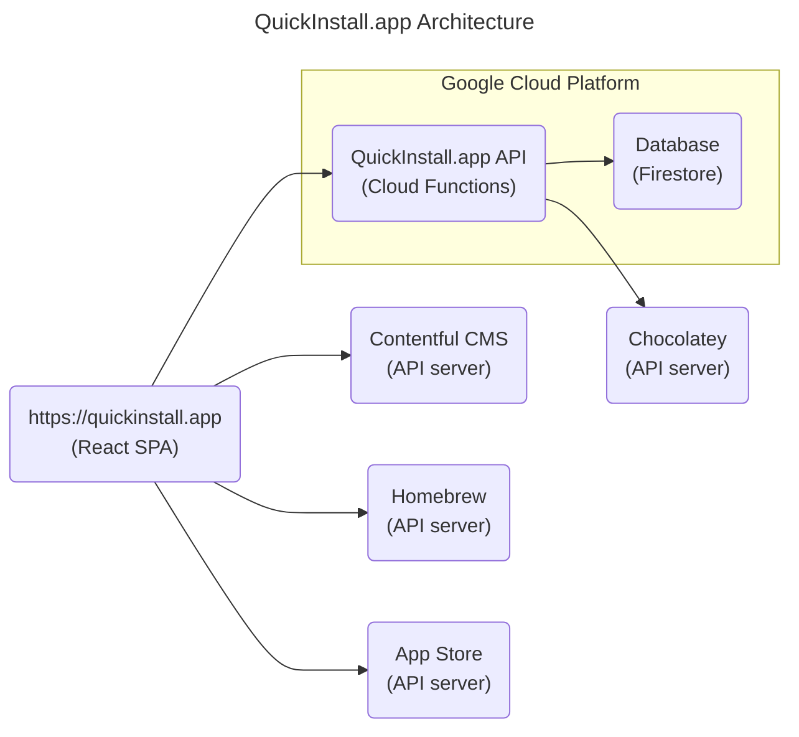

# QuickInstall.app

Gone are the days of manually hunting and installing apps. Introducing [QuickInstall.app](https://quickinstall.app), the revolutionary tool that automates the entire process, saving you time and effort.

*One command, infinite possibilities!*

## Introduction

As a software engineer, I was tired of the tedious and time-consuming process of setting up a new Mac or Windows computer. I knew there had to be a better way. That's why I created [QuickInstall.app](https://quickinstall.app), a powerful tool that empowers you to:

* **Install thousands of apps for your Windows or macOS at once with a single command.** No more searching for downloads or navigating complex installation process. [QuickInstall.app](https://quickinstall.app) curates a massive library of over 10,000 essential apps, making it a one-stop shop for your Windows or macOS needs.
* **Customise your Mac to your unique style.** Express your individuality with a wide range of customisation tweaks. From themes and icons to dock configurations and hidden features, [QuickInstall.app](https://quickinstall.app) lets you tailor your Mac to your exact preferences.

This [article]() explains the motivation behind this project.

### Supported package repositories

#### Windows

* [Chocolatey](https://chocolatey.org/)

#### macOS

* [Homebrew](https://brew.sh/): The missing package manager for macOS
* [Homebrew Cask](https://formulae.brew.sh/cask/) An extension to [Homebrew](https://brew.sh/) that allows you to install macOS applications
* [AppStore](https://www.apple.com/app-store/): A macOS app store platform maintained by Apple Inc

### Supported tweaks

* [macOS tweaks](https://github.com/ayltai/ansible-macOS-tweaks): A collection of over 50 macOS customisations

## Architecture

## Getting started

Try it here: [https://quickinstall.app](https://quickinstall.app)

The documentation for the backend can be found [here](backend/README.md).

The documentation for the frontend can be found [here](frontend/README.md).

The documentation for the infrastructure provisioning and deployment can be found [here](infra/README.md).

## License

[QuickInstall.app](https://quickinstall.app) © 2024 by [Alan Tai](https://linkedin.com/in/ayltai) is licensed under [CC BY-NC-SA 4.0](http://creativecommons.org/licenses/by-nc-sa/4.0/). To view a copy of this license, visit http://creativecommons.org/licenses/by-nc-sa/4.0/
